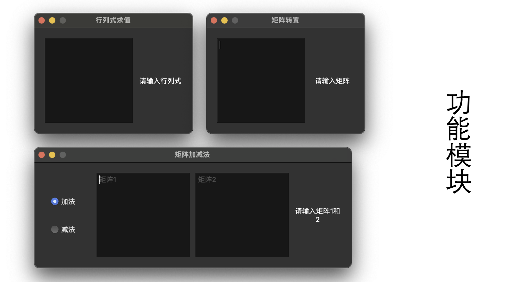
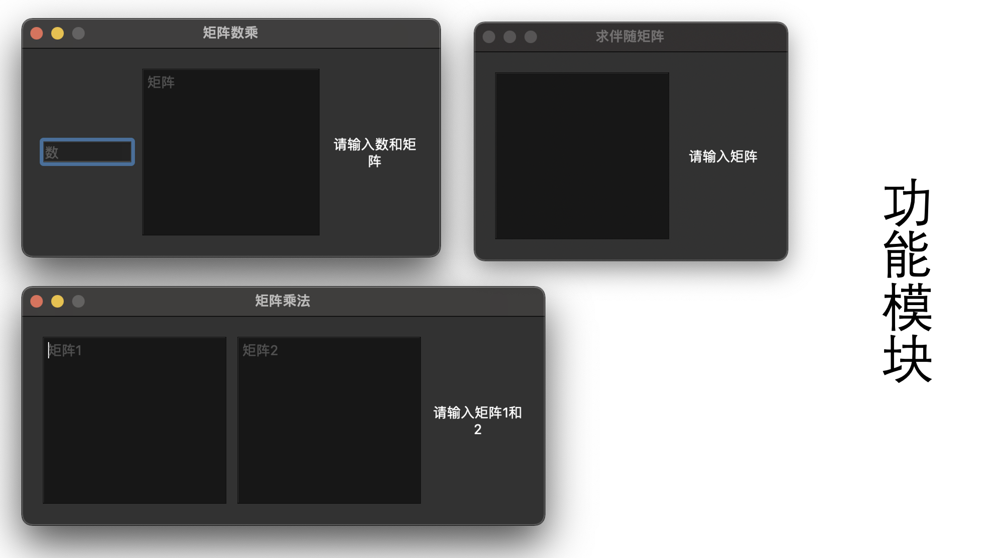
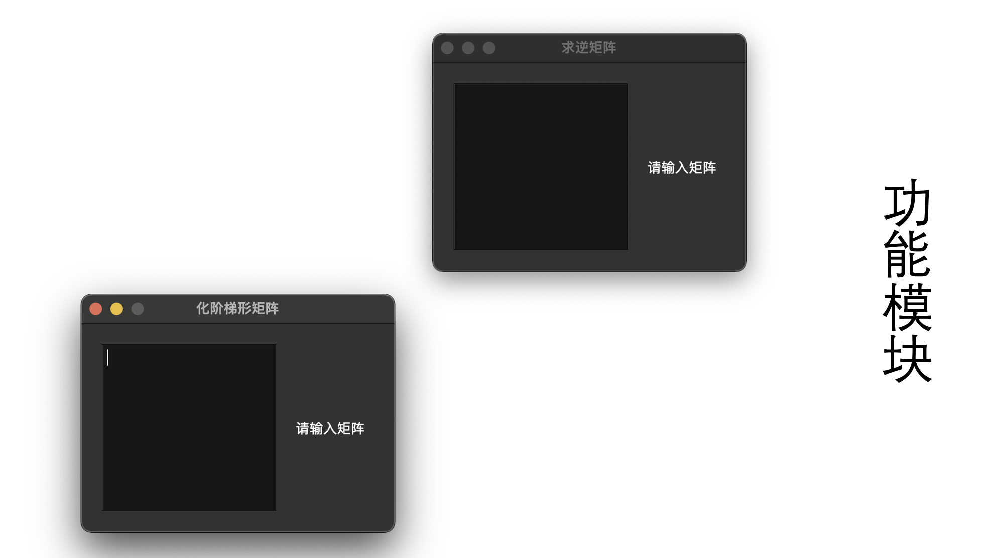

# LinearAlgebra
本程序为矩阵/行列式计算器，基于Qt开发，支持跨平台编译和运行，代码量为2100行至2200行。支持整数和分数运算，目前支持功能有：行列式求值、矩阵转置、矩阵加减法、矩阵数乘、矩阵乘法、求伴随矩阵、求逆矩阵、化简阶梯形矩阵。程序采用文本框进行矩阵输入，理论上支持无限阶矩阵（由于输入矩阵阶数过大会导致程序卡顿目前将矩阵阶数限制在10阶），通过空格和换行自动识别矩阵的行数和列数，并且对错误输入能够自动识别并提示，计算结果为实时显示。

